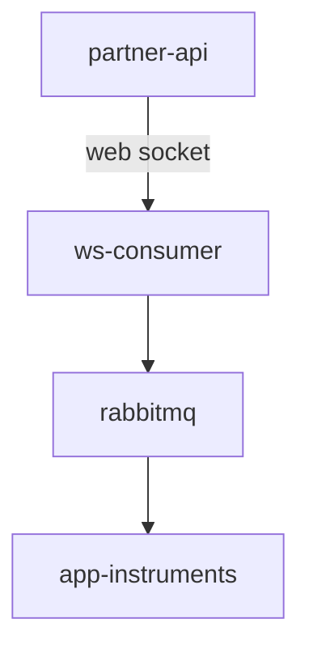

    app-instruments --> storage
    app-instruments --> rabbitmq
    api --> app-instruments
    api --> app-alerts
    api --subscribe--> app-quotes
    rabbitmq --> app-quotes

[//]: # (rabbitmq --> app-quotes)

[//]: # (rabbitmq --> app-alerts)

[//]: # (app-instruments --> rabbitmq)

[//]: # (app-quotes --> rabbitmq)

[//]: # (app-alerts --> storage)

[//]: # (internal-bus --> api)
    

