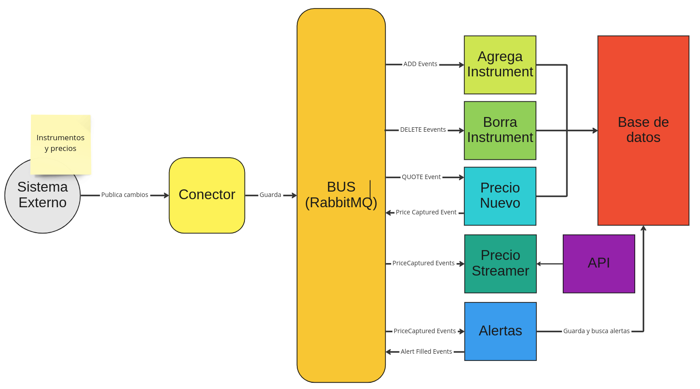

# Market data project

This is the code used in the talk "Desarrollo de aplicaciones financieras en 2023" on 13.03.2023
by "La semana de ingenieria de la UACH"

## Setup

### External systems

```shell
cd env
docker build -t partner-api .
docker compose up
```

This will start 3 things, MongoDB, RabbitMQ and the partner API

One created the RabbitMQ container, you will need to create a new user/password to allow the application to connect
please follow the instructions [here](https://www.tutlane.com/tutorial/rabbitmq/rabbitmq-users)

- go to http://localhost:15672/
- User/Password = user/secret
- new user and password => market_data/12345

### Run

```shell
./gradlew bootRun
```

The application runs on port 8081

### Architecture

The system consist in several components that communicate to each other with and external event bus (RabbitMQ).
As well the system have an internal bus created with spring webflux to handle subscriptions between controllers
and the main core.



- Connector: it allows the system to have a back pressure by just converting and filtering events and publish them in
the bus
- RabbitMQ: It has several topics inside by event type, and it has one queue to one each topic
- The three types of events are process by separate components.
- Some components create new events that are send back into the bus